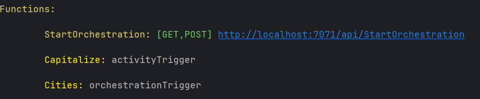

# Azure Durable Function – Java 17

This project demonstrates the implementation of a **stateful serverless application** on **Azure** using **Durable Functions** in **Java 17**.  
It follows the official [Azure Durable Functions Quickstart (Java)](https://learn.microsoft.com/en-us/azure/azure-functions/durable/quickstart-java?tabs=bash&pivots=create-option-manual-setup).

---

## 📌 Notes
- The tutorial classes provided in the quickstart have been **disabled**.
- This is achieved via `local.settings.json`:

```json
"AzureWebJobs.<Name_of_Trigger>.Disabled": true
```
---
## 📌 Validate
<p>
Once the app is built inside project_root/target 'azure-functions' folder will be created. If this folder is created succesfully then
azure-functions plugin will be able to launch the durable function. The following picture depicts the output.

</p>

